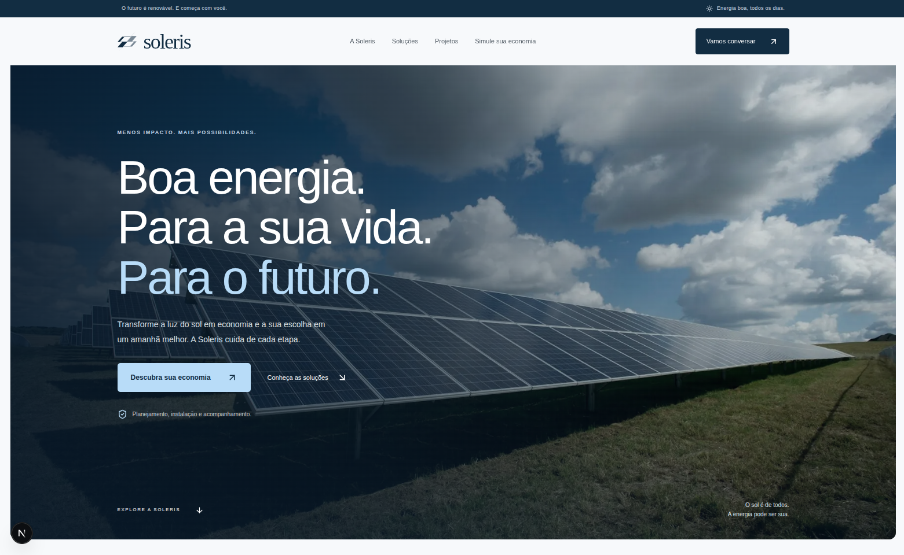

<div align="center">

# Soleris

**Boa energia. Para a sua vida. Para o futuro.**

Uma experiência web de energia solar que combina identidade visual própria, fotografia e ferramentas interativas para apresentar soluções com clareza.

**[Acesse o site ao vivo](https://soleris-energy.netlify.app/)**

[Conheça o projeto](#sobre-o-projeto) · [Funcionalidades](#funcionalidades) · [Executar localmente](#executar-localmente)

</div>



## Sobre o projeto

A Soleris é uma empresa fictícia de energia solar, criada como projeto de portfólio. O site apresenta soluções para residências, negócios e propriedades rurais, conduzindo a visita da descoberta à simulação de economia e à preparação de um estudo personalizado.

A identidade combina azul profundo, azul claro e branco. A marca vetorial foi desenhada a partir de um **S formado por superfícies sobrepostas**. Fotografia, tipografia e espaços organizam o conteúdo, com uma composição adaptada ao computador e ao celular.

## Funcionalidades

- **Soluções por segmento:** abas para explorar aplicações residenciais, comerciais e rurais, com navegação por teclado.
- **Galeria de aplicações:** filtros por segmento e detalhes em modais com fechamento por Escape e retorno do foco.
- **Simulador de economia:** conta mensal ajustável e cenários de redução de 60%, 80% e 90%, com resultados mensais e anuais.
- **Guia solar:** perguntas e respostas sempre visíveis, em uma organização editorial.
- **Solicitação de estudo:** formulário validado que prepara um arquivo de texto para download local.
- **Navegação responsiva:** menu móvel, links entre seções, informações de privacidade e atalho para o conteúdo principal.
- **Imagens otimizadas:** fotografias armazenadas no projeto e servidas pelo componente Image do Next.js.

## Tecnologias

| Tecnologia | Uso |
| --- | --- |
| Next.js 16 / App Router | Estrutura da aplicação, renderização e otimização de imagens |
| React 18 | Componentes e interações |
| TypeScript | Tipagem e organização do código |
| CSS | Identidade visual, composição e responsividade |
| Lucide React | Ícones funcionais da interface |
| Node.js Test Runner | Testes da lógica da simulação |

## Executar localmente

**Requisito:** Node.js **22.6 ou superior** e npm.

```bash
git clone https://github.com/GisellyPereira/SOLeris.git
cd SOLeris
npm ci
npm run dev
```

Acesse [localhost:3000](http://localhost:3000).

Para escolher outra porta:

```bash
npm run dev -- --port 3017
```

### Validação e produção

```bash
npm run typecheck   # Verifica os tipos
npm test            # Testa os cenários e limites da simulação
npm run build       # Compila para produção
npm start           # Inicia a versão compilada
```

## Organização

```text
app/
  page.tsx              Página principal
  layout.tsx            Layout e metadados
  globals.css           Estilos e responsividade
  icon.svg              Ícone da marca
components/
  SolerisSite.tsx        Composição e interações
  ui.tsx                Marca e elementos reutilizáveis
lib/
  content.ts            Soluções, aplicações e perguntas
  domain/savings.ts     Cálculo dos cenários de economia
public/
  brand/                Logo vetorial
  images/               Fotografias ilustrativas
docs/
  soleris-preview.png   Prévia da página inicial
tests/
  savings.test.mjs      Testes da simulação
```

Conteúdos podem ser adaptados em `lib/content.ts`. A lógica da simulação fica separada da interface em `lib/domain/savings.ts`.

## Escopo da demonstração

A empresa, as aplicações e a galeria são conceituais. As fotografias não representam instalações executadas pela Soleris.

A calculadora apresenta cenários ilustrativos, sem garantir uma economia específica. Tarifa, consumo, geração, custos e características do imóvel precisam ser avaliados em um projeto real.

O formulário **prepara uma solicitação no dispositivo**, sem enviar dados ou armazená-los em um servidor. Para receber contatos reais, é necessário integrar um serviço de envio e configurar o destinatário, atualizando os textos de privacidade e confirmação.

## Recursos visuais

A logo está disponível em [SVG](public/brand/soleris.svg). As fotografias ilustrativas são provenientes do Unsplash e estão armazenadas em `public/images`:

- [Painéis sob a luz do sol](https://images.unsplash.com/photo-1509391366360-2e959784a276)
- [Profissional em instalação elétrica](https://images.unsplash.com/photo-1621905251189-08b45d6a269e)
- [Instalação de painéis ao entardecer](https://images.unsplash.com/photo-1613665813446-82a78c468a1d)
- [Paisagem com energia renovável](https://images.unsplash.com/photo-1466611653911-95081537e5b7)

## Autoria

Projeto de **[Giselly Pereira](https://github.com/GisellyPereira)**.
